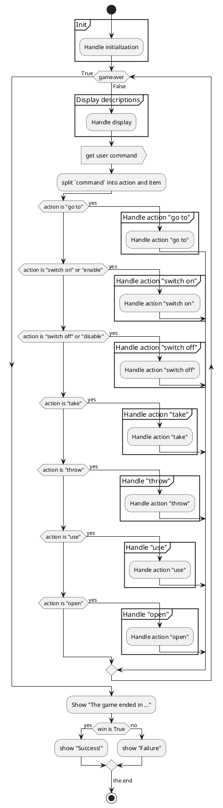

# Text Adventure 1

This is a super small and simple adventure game. 
It written in python, doesn't have a game engine or any graphics.
The basic theme would be an escape room, since there is only one róom the game, and the objective is to unlock the door and leave the room.

Even if its a single player game, the is a kind of turn round trip. 
The user types a command, some states change, a new set of informations diplay, and the user is prompted to type another command.

## Flow 

We have made a main loop, that runs until we have `game over`. We introduced the variable `gameover`, to handle this state. To start with we set this to the boolean value `False`.

Inside the main-loop we 
1. Display descriptions based on states
1. Get next command from user
1. Split user command in action and item
1. Take action for each of the possible actions

The loop end if we have `gameover` if True. That only happens when the user exits the door, og pres `q` (or `quit`).

Each action is delegated to sub flowcharts for each action. See below.

We will try to handle each action in the dociments listed below.

<!--

-->

## Sub flowcharts

### Init 
About how all variable are initialized to their startup values.  
See [Init.md](docs/Init.md)

### Display_descriptions
### Handle_action_go_to
### Handle_action_open
### Handle_action_switch_off
### Handle_action_switch_on
### Handle_action_take
### Handle_action_throw
### Handle_action_use

docs\Display_descriptions.puml
docs\Handle_action_go_to.puml
docs\Handle_action_open.puml
docs\Handle_action_switch_off.puml
docs\Handle_action_switch_on.puml
docs\Handle_action_take.puml
docs\Handle_action_throw.puml
docs\Handle_action_use.puml
