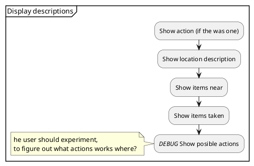

# Display

<!--

-->


This section should handle the following tasks:
1. Show action (if the was one);
1. Show location description;
1. Show items near;
1. Show items taken;
1. _DEBUG_ Show posible actions;

## 1. Show action description
If the user made a command with an action, that action shall be described.  
The action could be:
* go to door
* take key

These action should result in `action_description` like
* _You go to the door_
* _You take the key_ or _There is no key, here_

The value of `action_description` is set in the section of th respective action.

The value of `action_description` shall be displayed here.

```python
print(action_description)
```

## 2. Show location description;