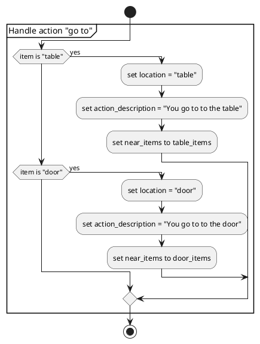

# Handle Action "go to"

<!--

```plantuml
@startuml
!pragma useVerticalIf on

start

partition Handle action "go to" {
    if (item is "table") then (yes)
        :set location = "table";
        :set action_description = "You go to to the table";
        :set near_items to table_items;
    elseif (item is "door") then (yes)
        :set location = "door";
        :set action_description = "You go to to the door";
        :set near_items to door_items;
    endif
}

stop
@enduml
```
-->