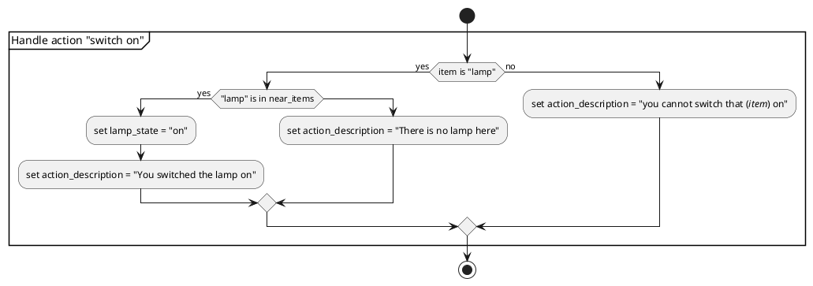

# Handle action "switch on"

<!-- 

```plantuml
@startuml
!pragma useVerticalIf on

start

partition Handle action "switch on" {
    if (item is "lamp") then (yes)
        if ("lamp" is in near_items) then (yes)
            :set lamp_state = "on";
            :set action_description = "You switched the lamp on";
        else 
            :set action_description = "There is no lamp here";
        endif
    else (no)
        :set action_description = "you cannot switch that (//item//) on";
    endif
}  

stop
@enduml
```
 -->
