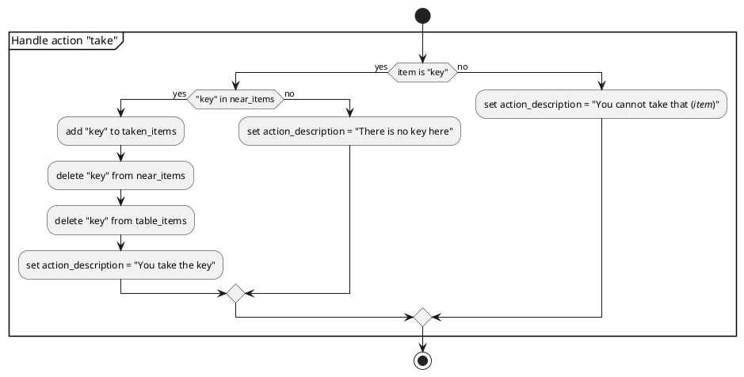

# Handle action "take"

<!-- 

```plantuml
@startuml
!pragma useVerticalIf on

start

partition Handle action "take" {
    if (item is "key") then (yes)
        if ("key" in near_items) then (yes)
            :add "key" to taken_items;
            :delete "key" from near_items;
            :delete "key" from table_items;
            :set action_description = "You take the key";
        else (no)
            :set action_description = "There is no key here";
        endif
    else (no)
        :set action_description = "You cannot take that (//item//)";
    endif
}

stop
@enduml
```
 -->
