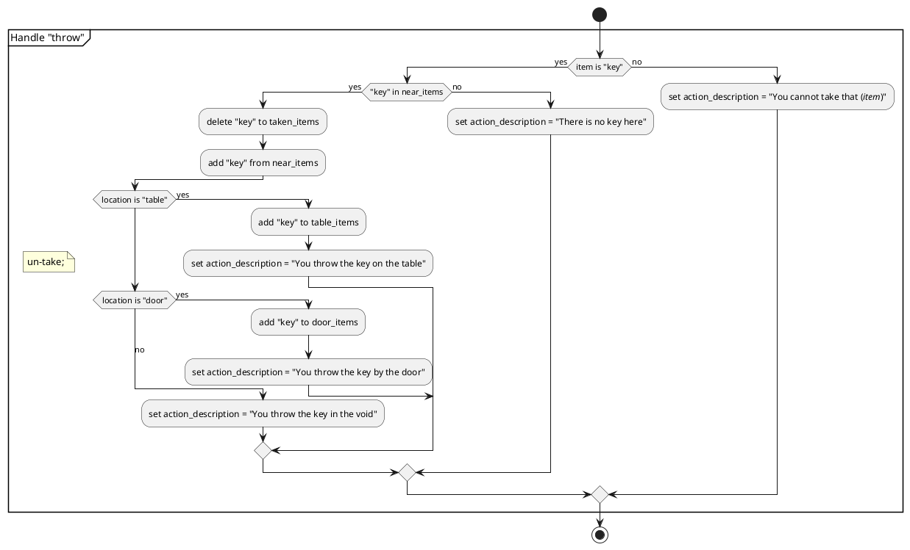

# Handle action "throw" 

<!-- 

```plantuml
@startuml
!pragma useVerticalIf on

start

partition Handle "throw" {
    floating note left: un-take;
    if (item is "key") then (yes)
        if ("key" in near_items) then (yes)
            :delete "key" to taken_items;
            :add "key" from near_items;
            if(location is "table") then (yes)
                :add "key" to table_items;
                :set action_description = "You throw the key on the table";
            elseif (location is "door") then (yes)
                :add "key" to door_items;
                :set action_description = "You throw the key by the door";
            else (no)
                :set action_description = "You throw the key in the void";
            endif
        else (no)
            :set action_description = "There is no key here";
        endif
    else (no)
        :set action_description = "You cannot take that (//item//)";
    endif
}

stop
@enduml
```
 -->
