# Initilazation

Initialization of variables to initial values.
At last we print to screen, som introductional info and the initail descriptions.

```plantuml
@startuml
partition Init {
    :set initial state values;
    ' note left
    '     Several states to be detailed later
    '     * gameover
    '     * location
    '     * items near
    '     * items state
    '     * items taken
    ' end note
}
@enduml
```

## Variables and values

name                    | value     | .
:-                      | :-        |:-
`gameover`              | `false`   |
`current_location`      | `"floor"` |
`near_items`            | `[]`      | empty list. key, lamp and door can be added
`taken_items`           | `[]`      | empty list. key can beadded

### Item states

name        | initial state     | possible states
:-          | :-                | :-
`lamp_state`      | `"switched off"`  | `"switched off"` or `"switched on"`
`door_state`        | `"locked"`        | `"locked"`, `"unlocked"` or `"open"`.          

